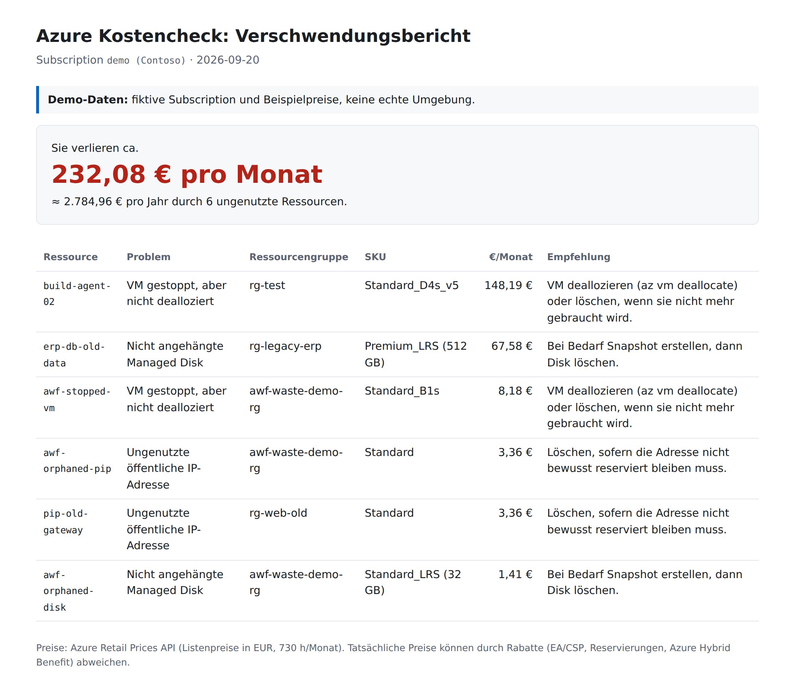
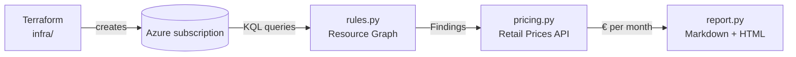

# Azure Waste Finder

A small **FinOps "Kostencheck"** for Azure: find resources that cost money but do nothing, and put a euro amount on them.

- **Terraform** deploys a deliberately wasteful demo environment.
- A **Python CLI** finds the waste with **Azure Resource Graph**, prices it with the public **Azure Retail Prices API**, and writes a client-style report: *"Sie verlieren ca. X € pro Monat"*.
- `terraform destroy` removes everything again.



*Sample report generated with `--demo` (fictional subscription, sample prices). See [docs/sample-report.md](docs/sample-report.md).*

## What it detects

| Rule | Why it wastes money | Recommended action |
|---|---|---|
| Unattached managed disk | Disks are billed by provisioned size, attached or not | Snapshot if needed, then delete |
| VM **stopped but not deallocated** | "Stopped" keeps the hardware reserved, so compute is still billed. Only "deallocated" stops the compute meter | `az vm deallocate` or delete |
| Orphaned public IP | Standard public IPs are billed per hour even without an association | Delete unless intentionally reserved |

## How it works



```
infra/                    Terraform: resource group, 5 € budget alert, 3 waste resources
scripts/stop-vm.(ps1|sh)  stops the demo VM WITHOUT deallocating it
src/waste_finder/
  queries/*.kql           one Resource Graph query per rule
  rules.py                runs the queries -> list[Finding]
  pricing.py              Retail Prices API -> €/month per finding (cached 24 h)
  report.py, templates/   German client report (Markdown + HTML)
  cli.py                  python -m waste_finder
  demo/                   fictional subscription + sample prices for --demo and tests
tests/                    pytest, runs fully offline
```

Design choices:

- **Resource Graph instead of listing resources per service**: one query language across all resource types and subscriptions, fast even for large tenants.
- **Retail Prices API**: public, no login, returns EUR. These are list prices; real prices can be lower with EA/CSP discounts, reservations or Azure Hybrid Benefit. The report says so.
- **Pluggable runners**: the rules and the pricing take a query/fetch function, so tests and `--demo` run without Azure.
- **Monthly estimate** uses 730 hours, the same convention the Azure pricing calculator uses.

## Quick start (demo, no Azure needed)

```bash
python -m venv .venv
# Windows: .venv\Scripts\activate    Linux/macOS: source .venv/bin/activate
pip install -e ".[dev]"
python -m waste_finder --demo
pytest
```

## Full run against a real subscription

Prerequisites: Azure CLI, Terraform >= 1.6, Python >= 3.11, an Azure subscription (e.g. *Azure for Students*).

```powershell
az login

# 1. Create the waste (~5 minutes)
cd infra
copy example.tfvars terraform.tfvars   # set alert_email; file is git-ignored
terraform init
terraform apply

# 2. Stop the VM without deallocating it
..\scripts\stop-vm.ps1                 # Linux/macOS: ../scripts/stop-vm.sh
cd ..

# 3. Find it
$env:AZURE_SUBSCRIPTION_ID = az account show --query id -o tsv
python -m waste_finder                 # writes reports/report.md and reports/report.html

# 4. Clean up - always
cd infra
terraform destroy
```

The demo environment uses the smallest SKUs (B1s VM, 32 GB Standard HDD, one Standard IP) and costs a few cents per hour. A budget alert on the resource group e-mails you at 50 % of 5 €.

If `terraform apply` says the VM size is not available, set `location` or `vm_size` in `terraform.tfvars`. If your subscription type does not support budgets, set `enable_budget = false`.

## Security

- Authentication uses `DefaultAzureCredential`, i.e. your local `az login`. No keys or secrets in the code or the repo.
- `*.tfstate` and `*.tfvars` are git-ignored: state contains resource IDs and the generated SSH key.
- The demo VM has no public IP and password login is disabled.
- The tool is **read-only**: it never changes or deletes anything in the subscription.

## Next steps

- Port to C#/.NET (Azure.ResourceManager.ResourceGraph)
- More rules: old snapshots, idle Premium disks, empty App Service Plans, unused load balancers
- Use the Cost Management API for actual (discounted) costs instead of list prices
- Azure DevOps pipeline that runs the check on a schedule and publishes the report
- Azure Workbook dashboard

## License

MIT
