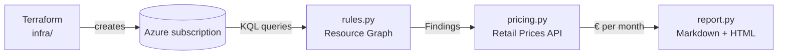

# Azure Waste Finder

[](https://github.com/viache25/azure-waste-finder/actions/workflows/ci.yml)
[](https://github.com/viache25/azure-waste-finder/actions/workflows/codeql.yml)

[](LICENSE)

A small **FinOps "Kostencheck"** for Azure: find resources that cost money but do nothing, and put a euro amount on them.

- **Terraform** deploys a deliberately wasteful demo environment.
- A **Python CLI** finds the waste with **Azure Resource Graph**, prices it with the public **Azure Retail Prices API**, and writes a client-style report: *"Sie verlieren ca. X € pro Monat"*.
- `terraform destroy` removes everything again.


*Sample report generated with `--demo` (fictional subscription, sample prices). See [docs/sample-report.md](docs/sample-report.md).*

## What it detects

| Rule | Why it wastes money | Recommended action |
|---|---|---|
| Unattached managed disk | Disks are billed by provisioned size, attached or not | Snapshot if needed, then delete |
| VM **stopped but not deallocated** | "Stopped" keeps the hardware reserved, so compute is still billed. Only "deallocated" stops the compute meter | `az vm deallocate` or delete |
| Orphaned public IP | Standard public IPs are billed per hour even without an association | Delete unless intentionally reserved |

## How it works


```mermaid
flowchart LR
    TF[Terraform<br/>infra/] -->|creates| AZ[(Azure subscription)]
    AZ -->|KQL queries| RG[rules.py<br/>Resource Graph]
    RG -->|Findings| PR[pricing.py<br/>Retail Prices API]
    PR -->|€ per month| RP[report.py<br/>Markdown + HTML]
```

```
infra/                    Terraform: resource group, 5 € budget alert, 3 waste resources
  tests/*.tftest.hcl      terraform test with mocked providers (no Azure login)
scripts/stop-vm.(ps1|sh)  stops the demo VM WITHOUT deallocating it
src/waste_finder/
  queries/*.kql           one Resource Graph query per rule
  rules.py                runs the queries -> list[Finding]
  pricing.py              Retail Prices API -> €/month per finding (cached 24 h)
  report.py, templates/   German client report (Markdown + HTML)
  cli.py                  python -m waste_finder
  demo/                   fictional subscription + sample prices for --demo and tests
tests/                    pytest (33 tests), runs fully offline, coverage floor 95 %
```

Design choices:

- **Resource Graph instead of listing resources per service**: one query language across all resource types and subscriptions, fast even for large tenants.
- **Retail Prices API**: public, no login, returns EUR. These are list prices; real prices can be lower with EA/CSP discounts, reservations or Azure Hybrid Benefit. The report says so.
- **Pluggable runners**: the rules and the pricing take a query/fetch function, so tests and `--demo` run without Azure.
- **Monthly estimate** uses 730 hours, the same convention the Azure pricing calculator uses.

## Quick start (demo, no Azure needed)

```bash
python -m venv .venv
# Windows: .venv\Scripts\activate    Linux/macOS: source .venv/bin/activate
pip install -e ".[dev]"
python -m waste_finder --demo
pytest
```

## Full run against a real subscription

Prerequisites: Azure CLI, Terraform >= 1.7, Python >= 3.11, an Azure subscription (e.g. *Azure for Students*).

```powershell
az login

# 1. Create the waste (~5 minutes)
cd infra
copy example.tfvars terraform.tfvars   # set alert_email; file is git-ignored
terraform init
terraform apply

# 2. Stop the VM without deallocating it
..\scripts\stop-vm.ps1                 # Linux/macOS: ../scripts/stop-vm.sh
cd ..

# 3. Find it
$env:AZURE_SUBSCRIPTION_ID = az account show --query id -o tsv
python -m waste_finder                 # writes reports/report.md and reports/report.html

# 4. Clean up - always
cd infra
terraform destroy
```

The demo environment uses the smallest SKUs (B1s VM, 32 GB Standard HDD, one Standard IP) and costs a few cents per hour. A budget alert on the resource group e-mails you at 50 % of 5 €.

If `terraform apply` says the VM size is not available, set `location` or `vm_size` in `terraform.tfvars`. If your subscription type does not support budgets, set `enable_budget = false`.

## Security

- Authentication uses `DefaultAzureCredential`, i.e. your local `az login`. No keys or secrets in the code or the repo.
- `*.tfstate` and `*.tfvars` are git-ignored: state contains resource IDs and the generated SSH key.
- The demo VM has no public IP and password login is disabled; the orphaned disk denies public network access. `terraform test` checks all of this in CI.
- Checkov scans `infra/` on every PR. Findings that are intentional for a waste environment (no customer-managed key on an empty disk, no NSG on a subnet without public endpoints) are skipped inline with a reason.
- CodeQL analyses the Python code on every PR, on `main` and weekly; `pip-audit` fails CI when a runtime or dev dependency has a known vulnerability.
- The tool is **read-only**: it never changes or deletes anything in the subscription.
- How to report a vulnerability: see [SECURITY.md](SECURITY.md).

## Development

```bash
pip install -e ".[dev]"          # pytest, pytest-cov, ruff, mypy
pytest --cov                     # tests + coverage; fails below the floor in pyproject.toml (95 %)
ruff check . && ruff format --check .
mypy                             # strict on src/
cd infra && terraform init -backend=false && terraform test   # mocked providers, no Azure login
tflint --init && tflint          # in infra/, config in infra/.tflint.hcl
pip install pre-commit && pre-commit install   # ruff + terraform fmt before each commit
pip install pip-audit && pip freeze --exclude-editable > /tmp/req.txt && pip-audit -r /tmp/req.txt --no-deps --disable-pip
```

CI (`.github/workflows/ci.yml`) runs on every pull request and on `main`:

| Job | What it checks |
|---|---|
| `lint` | `ruff check`, `ruff format --check`, `mypy` (strict) |
| `audit` | `pip-audit` on the installed runtime + dev dependencies (`pip freeze`), fails on known vulnerabilities |
| `python` | pytest on Python 3.11, 3.12 and 3.13 with the coverage floor; JUnit results as a check run, coverage (XML + HTML) as artifact `coverage-<version>`; demo report as artifact `demo-report` |
| `terraform` | `terraform fmt -check`, `init -backend=false`, `validate`, `terraform test` (mocked azurerm/tls providers: smallest SKUs, tags, budget toggle, no public IP on the VM, no password login), `tflint` with the azurerm ruleset |
| `config-scan` | Checkov on `infra/`, report-only: results as SARIF in the Security tab (category `checkov`) |

`.github/workflows/codeql.yml` runs CodeQL for Python on PRs, on `main` and weekly; alerts appear under Security → Code scanning.

Dependabot opens weekly PRs for pip, GitHub Actions and Terraform providers: minor and patch bumps grouped into one PR per ecosystem, major bumps as separate PRs. They are merged when CI is green.

## Roadmap

The plan lives in [issue #1](https://github.com/viache25/azure-waste-finder/issues/1): CI quality gates, a data-driven rule engine, more rules (old snapshots, empty App Service plans, idle network resources, downgrade candidates), actual costs from Cost Management, trends between runs, releases, a container image, a scheduled check via OIDC, a live end-to-end test, an Azure DevOps pipeline and an Azure Workbook.

## License

MIT
