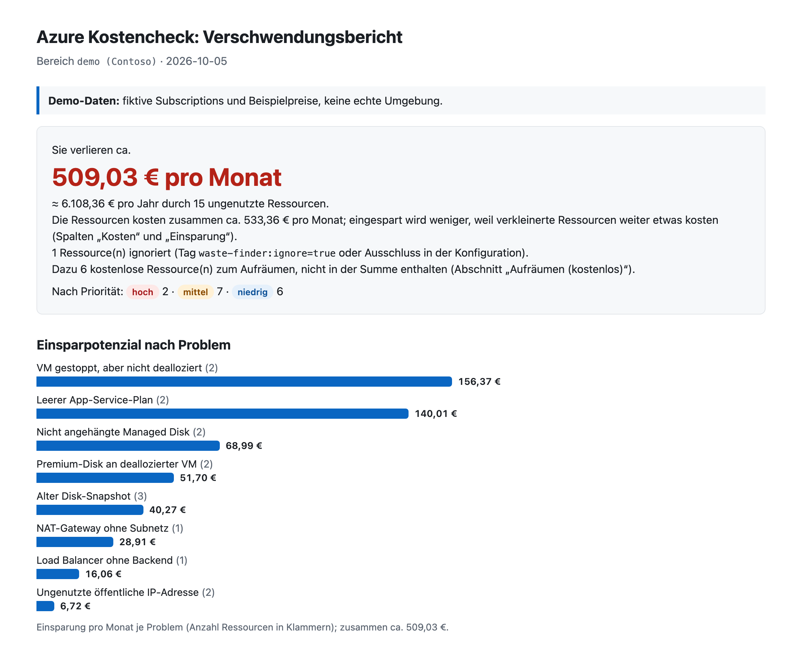
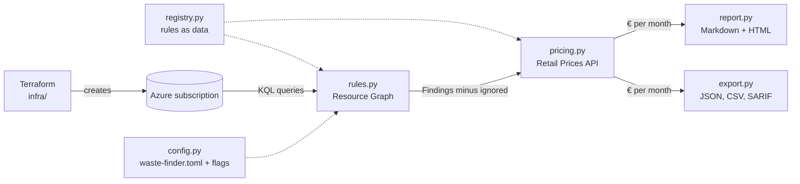

# Azure Waste Finder

[](https://github.com/viache25/azure-waste-finder/actions/workflows/ci.yml)
[](https://github.com/viache25/azure-waste-finder/actions/workflows/codeql.yml)

[](LICENSE)

A small **FinOps "Kostencheck"** for Azure: find resources that cost money but do nothing, and put a euro amount on them.

- **Terraform** deploys a deliberately wasteful demo environment.
- A **Python CLI** finds the waste with **Azure Resource Graph**, prices it with the public **Azure Retail Prices API**, and writes a client-style report: *"Sie verlieren ca. X € pro Monat"*.
- `terraform destroy` removes everything again.



*Sample report generated with `--demo` (fictional subscription, sample prices). See [docs/sample-report.md](docs/sample-report.md).*

## What it detects

| Rule | Severity | Why it wastes money | Recommended action |
|---|---|---|---|
| Unattached managed disk | medium | Disks are billed by provisioned size, attached or not | Snapshot if needed, then `az disk delete` |
| VM **stopped but not deallocated** | high | "Stopped" keeps the hardware reserved, so compute is still billed. Only "deallocated" stops the compute meter | `az vm deallocate` or delete |
| Orphaned public IP | low | Standard public IPs are billed per hour even without an association | `az network public-ip delete` unless intentionally reserved |
| Old disk snapshot | low | Snapshots are billed per GB-month for as long as they exist, even after the source disk is gone. Reported when older than 30 days (`--snapshot-min-age`); priced at the provisioned size, an upper bound because Azure bills the used size | Keep it only if it is still a needed backup, else `az snapshot delete` |
| Empty App Service plan | medium | A plan on a paid tier (Basic and up) bills per instance and hour even without any app. Free/Shared plans and Consumption plans are not reported | `az appservice plan delete`, or scale it down to Free (F1) |

Rules are data: each one is a single entry in `registry.py` (German and English title, severity, KQL file, pricing strategy, remediation text and `az` command, docs link) plus a KQL file. The report shows the severity, a docs link per rule and the exact `az` command per finding; the tool itself never runs them.

## How it works


```mermaid
flowchart LR
    TF[Terraform<br/>infra/] -->|creates| AZ[(Azure subscription)]
    REG[registry.py<br/>rules as data] -.-> RG
    REG -.-> PR
    AZ -->|KQL queries| RG[rules.py<br/>Resource Graph]
    CFG[config.py<br/>waste-finder.toml + flags] -.-> RG
    RG -->|Findings minus ignored| PR[pricing.py<br/>Retail Prices API]
    PR -->|€ per month| RP[report.py<br/>Markdown + HTML]
    PR -->|€ per month| EX[export.py<br/>JSON, CSV, SARIF]
```

```
infra/                    Terraform: resource group, 5 € budget alert, 3 waste resources
  extra-waste.tf          opt-in waste for the newer rules (enable_extra_waste = true)
  tests/*.tftest.hcl      terraform test with mocked providers (no Azure login)
scripts/stop-vm.(ps1|sh)  stops the demo VM WITHOUT deallocating it
src/waste_finder/
  registry.py             one entry per rule: titles, severity, KQL file, pricing strategy, remediation
  queries/*.kql           one Resource Graph query per rule
  rules.py                runs the queries over the chosen scope -> list[Finding]
  config.py               waste-finder.toml + CLI flags: rules, exclusions, threshold, currency
  pricing.py              pricing strategies: Retail Prices API -> €/month per finding (cached 24 h)
  report.py, templates/   German client report (Markdown + HTML)
  export.py               JSON, CSV, SARIF and the Markdown summary for CI
  cli.py                  python -m waste_finder
  demo/                   fictional subscription + sample prices for --demo and tests
tests/                    pytest (166 tests), runs fully offline, coverage floor 95 %
docs/report.schema.json   JSON Schema of report.json
```

Design choices:

- **Resource Graph instead of listing resources per service**: one query language across all resource types and subscriptions, fast even for large tenants.
- **Retail Prices API**: public, no login, returns EUR. These are list prices; real prices can be lower with EA/CSP discounts, reservations or Azure Hybrid Benefit. The report says so.
- **Pluggable runners**: the rules and the pricing take a query/fetch function, so tests and `--demo` run without Azure.
- **Cost vs. savings**: a finding carries what the resource costs now and, optionally, what acting on it saves (e.g. a downgrade). The report total is the sum of savings, which default to the full cost.
- **Monthly estimate** uses 730 hours, the same convention the Azure pricing calculator uses.

## Quick start (demo, no Azure needed)

```bash
python -m venv .venv
# Windows: .venv\Scripts\activate    Linux/macOS: source .venv/bin/activate
pip install -e ".[dev]"
python -m waste_finder --demo
pytest
```

## Full run against a real subscription

Prerequisites: Azure CLI, Terraform >= 1.7, Python >= 3.11, an Azure subscription (e.g. *Azure for Students*).

```powershell
az login

# 1. Create the waste (~5 minutes)
cd infra
copy example.tfvars terraform.tfvars   # set alert_email; file is git-ignored
terraform init
terraform apply

# 2. Stop the VM without deallocating it
..\scripts\stop-vm.ps1                 # Linux/macOS: ../scripts/stop-vm.sh
cd ..

# 3. Find it
$env:AZURE_SUBSCRIPTION_ID = az account show --query id -o tsv
python -m waste_finder                 # writes reports/report.md and reports/report.html
                                       # (see "Scope, rules and exclusions" for more subscriptions)

# 4. Clean up - always
cd infra
terraform destroy
```

The demo environment uses the smallest SKUs (B1s VM, 32 GB Standard HDD, one Standard IP) and costs a few cents per hour. A budget alert on the resource group e-mails you at 50 % of 5 €.

**Opt-in extra waste** for the newer rules: set `enable_extra_waste = true` in `terraform.tfvars` (default `false`). Approximate list prices in West Europe:

| Resource | Found by | Approx. cost |
|---|---|---|
| Incremental snapshot of the orphaned 32 GB disk | `old_snapshot` | at most 0.002 €/h (0.044 € per GB-month × 32 GB; the disk is empty, so in practice close to 0) |
| Empty App Service plan, B1 Linux, 1 instance | `empty_app_service_plan` | about 0.016 €/h (~11.50 € per month) |

Snapshots are only reported once they are 30 days old; right after `apply`, run the finder with `--snapshot-min-age 0` to see it.

If `terraform apply` says the VM size is not available, set `location` or `vm_size` in `terraform.tfvars`. If your subscription type does not support budgets, set `enable_budget = false`.

## Scope, rules and exclusions

```bash
waste-finder --subscription <id> [--subscription <id2> ...]   # default: $AZURE_SUBSCRIPTION_ID
waste-finder --all-subscriptions                              # every subscription the login can read
waste-finder --management-group <mg-id>                       # all subscriptions below a management group
waste-finder --rules stopped_vm,orphaned_public_ip            # only these rules
waste-finder --exclude '*/resourceGroups/rg-sandbox/*'        # glob on the resource ID, repeatable
waste-finder --min-savings 5                                  # leave out findings that save < 5 per month
waste-finder --snapshot-min-age 90                            # report disk snapshots older than 90 days (default 30)
waste-finder --currency CHF                                   # Retail API currency (default EUR)
waste-finder --config path/to/waste-finder.toml               # default: ./waste-finder.toml if present
waste-finder --format md,html,json,csv,sarif                  # output formats (default md,html)
waste-finder --fail-over 100 --summary "$GITHUB_STEP_SUMMARY" # exit code 3 above 100 per month; CI summary
```

| Flag | Meaning |
|---|---|
| `--subscription ID` | Subscription to scan; repeat for several. Default `$AZURE_SUBSCRIPTION_ID` |
| `--all-subscriptions` | Every subscription the credential can read (Resource Graph at tenant scope) |
| `--management-group ID` | All subscriptions below this management group |
| `--rules A,B` | Run only these rules (ids: `unattached_disk`, `stopped_vm`, `orphaned_public_ip`, `old_snapshot`, `empty_app_service_plan`) |
| `--exclude PATTERN` | Ignore resources whose ID matches the glob (case-insensitive); repeatable |
| `--min-savings AMOUNT` | Leave out findings that save less per month; unpriced findings stay in |
| `--snapshot-min-age DAYS` | `old_snapshot` reports snapshots at least this many days old (default 30; age from the snapshot's creation time) |
| `--currency CODE` | Currency for list prices, e.g. `EUR`, `CHF`, `USD` (`--demo` always uses its EUR sample prices) |
| `--format A,B` | Output formats: `md`, `html`, `json`, `csv`, `sarif` (default `md,html`); written as `report.<format>` |
| `--fail-over AMOUNT` | Exit with code 3 when the monthly waste is above this amount (reports are still written) |
| `--summary FILE` | Append a short Markdown summary to this file, e.g. `$GITHUB_STEP_SUMMARY`; an empty value is ignored |
| `--config PATH` | Config file; without it `./waste-finder.toml` is used when it exists |
| `--out-dir DIR` | Where the `report.<format>` files go (default `reports/`) |
| `--demo` | Built-in fake data, no Azure access |

The three scope flags are mutually exclusive. The report groups findings by subscription, with a subtotal for each.

**Ignoring resources:** tag a resource `waste-finder:ignore=true` (key and value case-insensitive) and it is never reported. Ignored resources, by tag or by `exclude` pattern, are counted in the report as "ignoriert"; findings below the threshold are counted separately. The demo subscription has one tagged public IP to show this.

**Config file** (`waste-finder.toml`, all keys optional; unknown keys are an error). Precedence: defaults < file < CLI flags; a flag replaces the file value, including lists.

```toml
rules = ["unattached_disk", "stopped_vm", "old_snapshot"]   # default: all rules
exclude = ["/subscriptions/*/resourceGroups/rg-sandbox/*"]
currency = "EUR"
formats = ["md", "html", "json"]   # default: md, html

[thresholds]
min_monthly_savings = 1.0
fail_over = 100.0                  # exit code 3 when the monthly total is higher
snapshot_min_age_days = 30         # old_snapshot: only snapshots at least this many days old
```

## Output formats and exit codes

| Format | File | Use |
|---|---|---|
| `md`, `html` | `report.md`, `report.html` | German client report, grouped by subscription |
| `json` | `report.json` | Everything in the report, for scripts and later runs. Has a `schema_version` (currently `1.2`; 1.1 added `age_days`, 1.2 `quantity`) and is described by [docs/report.schema.json](docs/report.schema.json); the tests validate the demo output against it |
| `csv` | `report.csv` | One row per finding (subscription, resource group, rule, severity, age, quantity, cost, savings, currency, resource ID, `az` command) for Excel |
| `sarif` | `report.sarif` | SARIF 2.1.0 for GitHub code scanning: one rule per registry entry, one result per finding (`high` → error, `medium` → warning, `low`/`info` → note). Azure resources are not files, so the resource ID is the alert's path; a fingerprint of rule + resource ID keeps alerts stable, so cleaning up a resource closes its alert |

Upload the SARIF file in a workflow with `github/codeql-action/upload-sarif` (`sarif_file: reports/report.sarif`, `category: azure-waste-finder`) to see findings under Security → Code scanning.

| Exit code | Meaning |
|---|---|
| `0` | Run completed (waste may still have been found) |
| `2` | Usage or config error (unknown rule, format or currency, bad config file, no subscription given) |
| `3` | Monthly waste is above `--fail-over` / `fail_over` (strictly greater); all reports were written |

`--summary` appends a few lines (total, threshold verdict, one row per rule) to a file. In GitHub Actions, `--summary "$GITHUB_STEP_SUMMARY"` puts them on the run's summary page; CI does this for the demo run.

## Security

- Authentication uses `DefaultAzureCredential`, i.e. your local `az login`. No keys or secrets in the code or the repo.
- `*.tfstate` and `*.tfvars` are git-ignored: state contains resource IDs and the generated SSH key.
- The demo VM has no public IP and password login is disabled; the orphaned disk denies public network access. `terraform test` checks all of this in CI.
- Checkov scans `infra/` on every PR. Findings that are intentional for a waste environment (no customer-managed key on an empty disk, no NSG on a subnet without public endpoints) are skipped inline with a reason.
- CodeQL analyses the Python code on every PR, on `main` and weekly; `pip-audit` fails CI when a runtime or dev dependency has a known vulnerability.
- The tool is **read-only**: it never changes or deletes anything in the subscription.
- How to report a vulnerability: see [SECURITY.md](SECURITY.md).

## Development

```bash
pip install -e ".[dev]"          # pytest, pytest-cov, ruff, mypy
pytest --cov                     # tests + coverage; fails below the floor in pyproject.toml (95 %)
ruff check . && ruff format --check .
mypy                             # strict on src/
cd infra && terraform init -backend=false && terraform test   # mocked providers, no Azure login, Terraform >= 1.11
tflint --init && tflint          # in infra/, config in infra/.tflint.hcl
pip install pre-commit && pre-commit install   # ruff + terraform fmt before each commit
pip install pip-audit && pip freeze --exclude-editable > /tmp/req.txt && pip-audit -r /tmp/req.txt --no-deps --disable-pip
```

CI (`.github/workflows/ci.yml`) runs on every pull request and on `main`:

| Job | What it checks |
|---|---|
| `lint` | `ruff check`, `ruff format --check`, `mypy` (strict) |
| `audit` | `pip-audit` on the installed runtime + dev dependencies (`pip freeze`), fails on known vulnerabilities |
| `python` | pytest on Python 3.11, 3.12 and 3.13 with the coverage floor; JUnit results as a check run, coverage (XML + HTML) as artifact `coverage-<version>`; demo report in all formats (md, html, json, csv, sarif) as artifact `demo-report`, with its summary on the run page |
| `terraform` | `terraform fmt -check`, `init -backend=false`, `validate`, `terraform test` (mocked azurerm/tls providers: smallest SKUs, tags, budget toggle, no public IP on the VM, no password login, extra waste off by default), `tflint` with the azurerm ruleset |
| `config-scan` | Checkov on `infra/`, report-only: results as SARIF in the Security tab (category `checkov`) |

`.github/workflows/codeql.yml` runs CodeQL for Python on PRs, on `main` and weekly; alerts appear under Security → Code scanning.

Dependabot opens weekly PRs for pip, GitHub Actions and Terraform providers: minor and patch bumps grouped into one PR per ecosystem, major bumps as separate PRs. They are merged when CI is green.

## Roadmap

The plan lives in [issue #1](https://github.com/viache25/azure-waste-finder/issues/1): CI quality gates, a data-driven rule engine, more rules (idle network resources, downgrade candidates, free clean-up findings), actual costs from Cost Management, trends between runs, releases, a container image, a scheduled check via OIDC, a live end-to-end test, an Azure DevOps pipeline and an Azure Workbook.

## License

MIT
