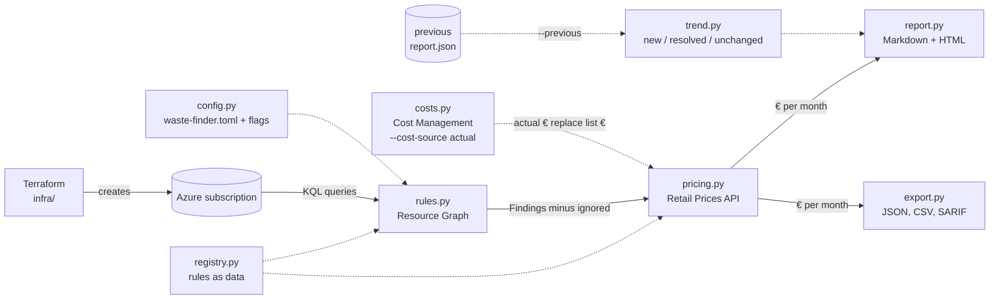

# Azure Waste Finder

[](https://github.com/viache25/azure-waste-finder/actions/workflows/ci.yml)
[](https://github.com/viache25/azure-waste-finder/actions/workflows/codeql.yml)
[](https://github.com/viache25/azure-waste-finder/releases/latest)
[](https://github.com/viache25/azure-waste-finder/actions/workflows/cd.yml)

[](LICENSE)

A small **FinOps "Kostencheck"** for Azure: find resources that cost money but do nothing, and put a euro amount on them.

- **Terraform** deploys a deliberately wasteful demo environment.
- A **Python CLI** finds the waste with **Azure Resource Graph**, prices it with the public **Azure Retail Prices API**, and writes a client-style report: *"Sie verlieren ca. X € pro Monat"*.
- `terraform destroy` removes everything again.


*Sample report generated with `--demo` (fictional subscription, sample prices). See [docs/sample-report.md](docs/sample-report.md).*

**Live demo report: <https://viache25.github.io/azure-waste-finder/>**. It is the HTML report of `--demo`, rebuilt from `main` after every green CI run, with [report.json](https://viache25.github.io/azure-waste-finder/report.json) ([schema](https://viache25.github.io/azure-waste-finder/report.schema.json)), [report.md](https://viache25.github.io/azure-waste-finder/report.md) and [report.csv](https://viache25.github.io/azure-waste-finder/report.csv) next to it.

## What it detects

| Rule | Severity | Why it wastes money | Recommended action |
|---|---|---|---|
| Unattached managed disk | medium | Disks are billed by provisioned size, attached or not | Snapshot if needed, then `az disk delete` |
| VM **stopped but not deallocated** | high | "Stopped" keeps the hardware reserved, so compute is still billed. Only "deallocated" stops the compute meter | `az vm deallocate` or delete |
| Orphaned public IP | low | Standard public IPs are billed per hour even without an association | `az network public-ip delete` unless intentionally reserved |
| Old disk snapshot | low | Snapshots are billed per GB-month for as long as they exist, even after the source disk is gone. Reported when older than 30 days (`--snapshot-min-age`); priced at the provisioned size, an upper bound because Azure bills the used size | Keep it only if it is still a needed backup, else `az snapshot delete` |
| Empty App Service plan | medium | A plan on a paid tier (Basic and up) bills per instance and hour even without any app. Free/Shared plans and Consumption plans are not reported | `az appservice plan delete`, or scale it down to Free (F1) |
| NAT gateway without subnet | medium | The gateway bills per hour (Retail API meter `Standard Gateway`) whether traffic flows or not; its public IPs bill on top | `az network nat gateway delete`, then check the freed public IPs |
| Load balancer without backends | low, or info | A Standard load balancer with empty backend pools still bills per hour for its load-balancing and outbound rules (first 5 rules one meter, then per rule). Without rules there is no hourly charge, so the finding costs 0 and becomes `info` | `az network lb delete`, or remove the rules until backends return |
| Premium disk on deallocated VM | medium | A deallocated VM bills no compute, but its Premium SSD / Standard SSD disks keep billing their tier. Reported when the VM has been deallocated for 30 days (`--downgrade-lookback`, from the disk's `LastOwnershipUpdateTime`). **Savings** = price difference to the Standard HDD tier of the same size, so the report shows cost and savings separately | `az disk update --sku Standard_LRS` while the VM stays deallocated, or delete VM and disks |
| Orphaned network interface | info (free) | Costs nothing, but holds a private IP and is usually left over from a deleted VM (NICs of private endpoints, private link services and PaaS workloads are skipped) | `az network nic delete` |
| Unattached NSG | info (free) | Costs nothing, but protects nothing until it is associated with a subnet or NIC | `az network nsg delete`, or associate it on purpose |
| Empty resource group | info (free) | Costs nothing, but clutters ownership, budgets and permissions (groups managed by a service, e.g. AKS node groups, are skipped) | `az group delete --name <rg>` |

A finding that saves nothing is always reported with severity `info`. Findings for resources that cost nothing (the three free rules above, or a load balancer without rules) go into a separate report section **"Aufräumen (kostenlos)"**: they are not part of the total, the savings threshold (`--min-savings`) does not drop them, and JSON lists them under `cleanup`.

Rules are data: each one is a single entry in `registry.py` (German and English title, severity, KQL file, pricing strategy, remediation text and `az` command, docs link) plus a KQL file. The report shows the severity, a docs link per rule and the exact `az` command per finding; the tool itself never runs them.

## How it works


```mermaid
flowchart LR
    TF[Terraform<br/>infra/] -->|creates| AZ[(Azure subscription)]
    REG[registry.py<br/>rules as data] -.-> RG
    REG -.-> PR
    AZ -->|KQL queries| RG[rules.py<br/>Resource Graph]
    CFG[config.py<br/>waste-finder.toml + flags] -.-> RG
    RG -->|Findings minus ignored| PR[pricing.py<br/>Retail Prices API]
    CM[costs.py<br/>Cost Management<br/>--cost-source actual] -.->|actual € replace list €| PR
    PR -->|€ per month| RP[report.py<br/>Markdown + HTML]
    PREV[(previous<br/>report.json)] -.->|--previous| TR[trend.py<br/>new / resolved / unchanged]
    TR -.-> RP
    PR -->|€ per month| EX[export.py<br/>JSON, CSV, SARIF]
```

```
Dockerfile, .dockerignore  container image (multi-stage, non-root), pushed to GHCR by cd.yml
infra/                    Terraform: resource group, 5 € budget alert, 3 waste resources
  extra-waste.tf          opt-in waste for the newer rules (enable_extra_waste = true)
  tests/*.tftest.hcl      terraform test with mocked providers (no Azure login)
  github-oidc/            Terraform: OIDC identity for GitHub Actions (app registration, federated
                          credentials, read-only roles), applied once by the owner
scripts/stop-vm.(ps1|sh)  stops the demo VM WITHOUT deallocating it
scripts/finops_issue.py   opens, updates or closes the "Azure waste report" issue (finops-check.yml)
scripts/e2e_assert.py     checks a live report against what Terraform deployed (e2e.yml)
src/waste_finder/
  registry.py             one entry per rule: titles, severity, KQL file, pricing strategy, remediation
  queries/*.kql           one Resource Graph query per rule
  rules.py                runs the queries over the chosen scope -> list[Finding]
  config.py               waste-finder.toml + CLI flags: rules, exclusions, threshold, currency
  pricing.py              pricing strategies: Retail Prices API -> €/month per finding (cached 24 h)
  costs.py                --cost-source actual: Cost Management Query API, amortized cost per resource
  trend.py                --previous: new, resolved and unchanged findings since an earlier report.json
  report.py, templates/   German client report (Markdown + HTML)
  export.py               JSON, CSV, SARIF and the Markdown summary for CI
  cli.py                  python -m waste_finder
  demo/                   fictional subscriptions, sample prices, Cost Management answers and an earlier
                          report.json (so the demo report shows a trend) for --demo and tests
tests/                    pytest (382 tests), runs fully offline, coverage floor 95 %
  fixtures/               recorded-format API responses (Cost Management)
docs/report.schema.json   JSON Schema of report.json
```

Design choices:

- **Resource Graph instead of listing resources per service**: one query language across all resource types and subscriptions, fast even for large tenants.
- **Retail Prices API**: public, no login, returns EUR. These are list prices; real prices can be lower with EA/CSP discounts, reservations or Azure Hybrid Benefit. The report says so. `--cost-source actual` uses what each resource really cost instead (see [Actual costs](#actual-costs-from-cost-management)).
- **Pluggable runners**: the rules and the pricing take a query/fetch function, so tests and `--demo` run without Azure.
- **Cost vs. savings**: a finding carries what the resource costs now and, optionally, what acting on it saves (e.g. a downgrade). The report total is the sum of savings, which default to the full cost; the tables show both columns, and the summary also gives the total cost when it differs.
- **Monthly estimate** uses 730 hours, the same convention the Azure pricing calculator uses.

## Quick start (demo, no Azure needed)

```bash
python -m venv .venv
# Windows: .venv\Scripts\activate    Linux/macOS: source .venv/bin/activate
pip install -e ".[dev]"
python -m waste_finder --demo
pytest
```

## Install from release

Each release on the [Releases page](https://github.com/viache25/azure-waste-finder/releases) has a wheel and an sdist, built and tested by `release.yml`:

```bash
gh release download --repo viache25/azure-waste-finder --pattern '*.whl'   # latest release
pip install azure_waste_finder-*.whl            # or: pipx install azure_waste_finder-*.whl
waste-finder --version
waste-finder --demo
```

Or straight from the release URL: `pip install https://github.com/viache25/azure-waste-finder/releases/download/v0.2.0/azure_waste_finder-0.2.0-py3-none-any.whl`.

## Container image

`ghcr.io/viache25/azure-waste-finder` is built from the [Dockerfile](Dockerfile) (multi-stage on `python:3.12-slim`, runs as the non-root user `finder`, uid 10001, entrypoint `waste-finder`, working directory `/work`). Every green CI run on `main` pushes it with two tags: the short commit SHA and `latest`.

```bash
docker run --rm ghcr.io/viache25/azure-waste-finder --version
docker run --rm ghcr.io/viache25/azure-waste-finder --demo --format md,html,json

# keep the reports: mount ./reports (run as your own uid so the files belong to you)
mkdir -p reports
docker run --rm --user "$(id -u):$(id -g)" -v "$PWD/reports:/work/reports" \
  ghcr.io/viache25/azure-waste-finder --demo --format md,html,json
```

The image has no Azure CLI, so `az login` does not carry over. For a real run, give `DefaultAzureCredential` what it reads from the environment: a workload identity / federated token (`AZURE_CLIENT_ID`, `AZURE_TENANT_ID`, `AZURE_FEDERATED_TOKEN_FILE`), a managed identity on Azure, or (least preferred) a service principal secret via `-e AZURE_CLIENT_ID -e AZURE_TENANT_ID -e AZURE_CLIENT_SECRET`. Reader on the subscription is enough.

Build it yourself with `docker build --build-arg VERSION=0.2.0 -t azure-waste-finder .` (the version build argument replaces the git tag, which is not in the build context).

## Full run against a real subscription

Prerequisites: Azure CLI, Terraform >= 1.7, Python >= 3.11, an Azure subscription (e.g. *Azure for Students*).

```powershell
az login

# 1. Create the waste (~5 minutes)
cd infra
copy example.tfvars terraform.tfvars   # set alert_email; file is git-ignored
terraform init
terraform apply

# 2. Stop the VM without deallocating it
..\scripts\stop-vm.ps1                 # Linux/macOS: ../scripts/stop-vm.sh
cd ..

# 3. Find it
$env:AZURE_SUBSCRIPTION_ID = az account show --query id -o tsv
python -m waste_finder                 # writes reports/report.md and reports/report.html
                                       # (see "Scope, rules and exclusions" for more subscriptions)

# 4. Clean up - always
cd infra
terraform destroy
```

The demo environment uses the smallest SKUs (B1s VM, 32 GB Standard HDD, one Standard IP) and costs a few cents per hour. A budget alert on the resource group e-mails you at 50 % of 5 €.

**Opt-in extra waste** for the newer rules: set `enable_extra_waste = true` in `terraform.tfvars` (default `false`). Approximate list prices in West Europe:

| Resource | Found by | Approx. cost |
|---|---|---|
| Incremental snapshot of the orphaned 32 GB disk | `old_snapshot` | at most 0.002 €/h (0.044 € per GB-month × 32 GB; the disk is empty, so in practice close to 0) |
| Empty App Service plan, B1 Linux, 1 instance | `empty_app_service_plan` | about 0.016 €/h (~11.50 € per month) |
| Internal Standard load balancer, empty backend pool, no rules | `idle_load_balancer` (info, 0 €) | 0 €/h: no rules, no hourly charge, no data processed |
| Orphaned NIC, unattached NSG, empty resource group | `orphaned_nic`, `unattached_nsg`, `empty_resource_group` | 0 €/h |

Snapshots are only reported once they are 30 days old; right after `apply`, run the finder with `--snapshot-min-age 0` to see it.

If `terraform apply` says the VM size is not available, set `location` or `vm_size` in `terraform.tfvars`. If your subscription type does not support budgets, set `enable_budget = false`. To deploy into an existing resource group instead of creating `<prefix>-waste-demo-rg`, set `resource_group_name` (the group's location then applies); the [live end-to-end test](#live-end-to-end-test) does this.

## Connect GitHub to Azure

The Azure workflows log in with **OpenID Connect**: GitHub gives each job a short-lived token, Entra ID trusts it through a federated credential, and no client secret exists anywhere. [`infra/github-oidc/`](infra/github-oidc) creates that identity with Terraform. Until the repository variables below are set, every Azure workflow skips its Azure job, so CI stays green without Azure.

| Resource | Purpose |
|---|---|
| App registration `github-azure-waste-finder` + service principal | The identity the workflows log in as (single tenant, no secret, no certificate) |
| Federated credential `github-branch` | Trusts subject `repo:viache25/azure-waste-finder:ref:refs/heads/main`: jobs without an environment in runs on `main` (scheduled and manual runs) |
| Federated credential `github-environment` | Trusts subject `repo:viache25/azure-waste-finder:environment:azure-e2e`: jobs in the GitHub environment `azure-e2e` (the live end-to-end test) |
| **Reader** + **Cost Management Reader** on the subscription | Resource Graph queries and `--cost-source actual`; nothing that can change a resource |
| Optional (`enable_e2e = true`): resource group `awf-e2e-rg` + **Contributor on that group only** | The live end-to-end test deploys the demo waste into this group and destroys it again. The group is tagged `waste-finder:ignore=true`, so the empty group is not reported between runs |

Prerequisites: Azure CLI, Terraform >= 1.7, GitHub CLI (`gh`). Your Azure account must be allowed to create app registrations (members can by default; otherwise the Entra role *Application Developer*) and role assignments on the subscription (*Owner*, *User Access Administrator* or *Role Based Access Control Administrator*).

```bash
az login
cd infra/github-oidc
terraform init
terraform apply -var "subscription_id=$(az account show --query id -o tsv)"
# with the resource group for the live end-to-end test:
# terraform apply -var "subscription_id=$(az account show --query id -o tsv)" -var enable_e2e=true

# Repository variables (IDs, not credentials). `terraform output -raw gh_variable_commands` prints these with your values.
gh variable set AZURE_CLIENT_ID --repo viache25/azure-waste-finder --body "$(terraform output -raw client_id)"
gh variable set AZURE_TENANT_ID --repo viache25/azure-waste-finder --body "$(terraform output -raw tenant_id)"
gh variable set AZURE_SUBSCRIPTION_ID --repo viache25/azure-waste-finder --body "$(terraform output -raw subscription_id)"
# only with enable_e2e = true:
gh variable set AZURE_E2E_RESOURCE_GROUP --repo viache25/azure-waste-finder --body "$(terraform output -raw e2e_resource_group)"
```

| Repository variable | Value | Effect |
|---|---|---|
| `AZURE_CLIENT_ID` | output `client_id` | Azure jobs run only when this is set (`if: vars.AZURE_CLIENT_ID != ''`) |
| `AZURE_TENANT_ID` | output `tenant_id` | Tenant for `azure/login` |
| `AZURE_SUBSCRIPTION_ID` | output `subscription_id` | Subscription the workflows scan |
| `AZURE_E2E_RESOURCE_GROUP` | output `e2e_resource_group` (`awf-e2e-rg`) | Resource group of the live end-to-end test |

The live end-to-end test also needs the GitHub environment `azure-e2e` with you as required reviewer, so every run waits for your approval:

```bash
echo "{\"reviewers\":[{\"type\":\"User\",\"id\":$(gh api user --jq .id)}]}" |
  gh api -X PUT repos/viache25/azure-waste-finder/environments/azure-e2e --input -
```

Other settings: `-var github_repository=owner/name` for a fork, `-var github_branch=...` / `-var github_environment=...` for other subjects (if you customized the repository's OIDC subject claim template, the subjects must match it). The local Terraform state holds only IDs (no secret); `terraform destroy` in `infra/github-oidc` removes the identity, its role assignments and the E2E group. `terraform test` checks the subjects, issuer and audience, that the subscription roles are exactly Reader + Cost Management Reader, and that Contributor exists only with `enable_e2e` and only on the E2E group.

## Scheduled FinOps check

[`.github/workflows/finops-check.yml`](.github/workflows/finops-check.yml) scans the subscription **every Monday at 06:17 UTC** and on demand (`gh workflow run finops-check.yml`, or Actions → FinOps check → Run workflow). It only reads, so it may run on a schedule.

1. `azure/login` with OIDC as the read-only identity from [Connect GitHub to Azure](#connect-github-to-azure).
2. Downloads the `report.json` of the previous run (artifact `finops-report` of the newest run on `main`) and passes it as `--previous`, so the report shows the change since last week. The first run, or a run after the artifact expired (90 days), has no trend.
3. Runs `waste-finder --subscription $AZURE_SUBSCRIPTION_ID --format md,html,json --summary $GITHUB_STEP_SUMMARY`: the summary appears on the run page, and the report is uploaded as artifact `finops-report`.
4. [`scripts/finops_issue.py`](scripts/finops_issue.py) keeps **one** issue titled **"Azure waste report"**. It finds the issue by title plus a hidden marker, so an issue you open with the same title is left alone.

| Monthly waste of the run | Issue |
|---|---|
| above the threshold | opened, or updated when already open: total, change since the last run, the 10 largest findings, link to the run |
| above zero but at or below the threshold | an open issue is updated, no new one is opened |
| zero (no findings left apart from free clean-up) | closed with a comment |

| Repository variable (optional) | Default | Meaning |
|---|---|---|
| `FINOPS_ISSUE_THRESHOLD` | `10` | Monthly amount (report currency) above which the issue is opened; the manual run has a `threshold` input that overrides it |
| `FINOPS_COST_SOURCE` | `retail` | `actual` uses Cost Management amounts (the identity has Cost Management Reader) |

Rules, exclusions, currency and the savings threshold come from a `waste-finder.toml` in the repository root, if you commit one (see [Scope, rules and exclusions](#scope-rules-and-exclusions)). Until `AZURE_CLIENT_ID` is set, the job is skipped and the run is green. GitHub disables scheduled workflows after 60 days without activity in the repository; re-enable the workflow in the Actions tab.

Preview the issue for any report without touching GitHub:

```bash
python scripts/finops_issue.py --report reports/report.json --threshold 10 --dry-run
```

## Live end-to-end test

[`.github/workflows/e2e.yml`](.github/workflows/e2e.yml) proves the whole chain against a real subscription: Terraform creates the waste, the finder finds it, Terraform removes it again. It is **manual only** (`gh workflow run e2e.yml`, or Actions → E2E → Run workflow) and never scheduled, because it creates resources.

1. The run waits for your approval (environment `azure-e2e`, required reviewer).
2. `terraform apply` of `infra/` into the resource group `awf-e2e-rg` from [Connect GitHub to Azure](#connect-github-to-azure) (`enable_e2e = true`). It uses a unique prefix `e2e-<run id>-<attempt>`, no budget and no extra waste. The identity has Contributor on that group only, so `infra/` deploys into the existing group (`resource_group_name`) instead of creating one.
3. `scripts/stop-vm.sh` stops the VM without deallocating it.
4. `waste-finder --subscription $AZURE_SUBSCRIPTION_ID --format json` runs with all rules. Then [`scripts/e2e_assert.py`](scripts/e2e_assert.py) checks that the unattached disk, the stopped VM and the orphaned public IP are each reported for exactly the resource Terraform created, in that group, with a monthly cost above 0. Resource Graph shows new resources and power states with a delay, so the step retries up to 10 times, once a minute.
5. `terraform destroy` **always** runs, also after a failed assertion, a failed apply or a cancel. The report and the expected names are uploaded as artifact `e2e-report`.

**Expected cost per run** (list prices West Europe, Retail Prices API, October 2026; a run takes about 15 to 25 minutes):

| Resource | Price |
|---|---|
| VM `Standard_B1s` (Linux, stopped but still allocated) | 0.0106 €/h |
| 2 × 32 GB Standard HDD (S4): the orphaned disk and the VM's OS disk | 2 × 1.35 € per month ≈ 0.0037 €/h |
| Standard static public IP | 0.0044 €/h |
| Virtual network, subnet, NIC | free |
| **Total** | **≈ 0.019 €/h: about 0.01 € per run, at most 0.02 € even if every meter is rounded up to a full hour** |

Prerequisites:
- [Connect GitHub to Azure](#connect-github-to-azure) applied with `enable_e2e = true`.
- The GitHub environment `azure-e2e` with you as required reviewer.
- Optionally `AZURE_E2E_RESOURCE_GROUP`, default `awf-e2e-rg`.
- The resource providers `Microsoft.Compute` and `Microsoft.Network` registered in the subscription. They are after any earlier `terraform apply` of `infra/`; otherwise run `az provider register --namespace Microsoft.Compute` and the same for `Microsoft.Network`. The identity cannot register providers itself.

If the destroy step fails (an Azure API error), the resources stay and cost about 0.45 € per day. Delete the group, then re-apply `infra/github-oidc`, which recreates the group and its role assignment:

```bash
az group delete --name awf-e2e-rg --yes
cd infra/github-oidc && terraform apply -var "subscription_id=$(az account show --query id -o tsv)" -var enable_e2e=true
```

## Scope, rules and exclusions

```bash
waste-finder --subscription <id> [--subscription <id2> ...]   # default: $AZURE_SUBSCRIPTION_ID
waste-finder --all-subscriptions                              # every subscription the login can read
waste-finder --management-group <mg-id>                       # all subscriptions below a management group
waste-finder --rules stopped_vm,orphaned_public_ip            # only these rules
waste-finder --exclude '*/resourceGroups/rg-sandbox/*'        # glob on the resource ID, repeatable
waste-finder --min-savings 5                                  # leave out findings that save < 5 per month
waste-finder --snapshot-min-age 90                            # report disk snapshots older than 90 days (default 30)
waste-finder --downgrade-lookback 14                          # SSD disks of VMs deallocated for 14+ days (default 30)
waste-finder --currency CHF                                   # Retail API currency (default EUR)
waste-finder --cost-source actual                             # actual costs from Cost Management, retail as fallback
waste-finder --format md,html,json --previous last/report.json  # trend since an earlier run
waste-finder --config path/to/waste-finder.toml               # default: ./waste-finder.toml if present
waste-finder --format md,html,json,csv,sarif                  # output formats (default md,html)
waste-finder --fail-over 100 --summary "$GITHUB_STEP_SUMMARY" # exit code 3 above 100 per month; CI summary
```

| Flag | Meaning |
|---|---|
| `--subscription ID` | Subscription to scan; repeat for several. Default `$AZURE_SUBSCRIPTION_ID` |
| `--all-subscriptions` | Every subscription the credential can read (Resource Graph at tenant scope) |
| `--management-group ID` | All subscriptions below this management group |
| `--rules A,B` | Run only these rules (ids: `unattached_disk`, `stopped_vm`, `orphaned_public_ip`, `old_snapshot`, `empty_app_service_plan`, `idle_nat_gateway`, `idle_load_balancer`, `premium_disk_deallocated_vm`, `orphaned_nic`, `unattached_nsg`, `empty_resource_group`) |
| `--exclude PATTERN` | Ignore resources whose ID matches the glob (case-insensitive); repeatable |
| `--min-savings AMOUNT` | Leave out findings that save less per month; unpriced findings stay in |
| `--snapshot-min-age DAYS` | `old_snapshot` reports snapshots at least this many days old (default 30; age from the snapshot's creation time) |
| `--downgrade-lookback DAYS` | `premium_disk_deallocated_vm` reports SSD disks whose VM has been deallocated for at least this many days (default 30) |
| `--currency CODE` | Currency for list prices, e.g. `EUR`, `CHF`, `USD` (`--demo` always uses its EUR sample prices) |
| `--cost-source SOURCE` | `retail` (default): list prices from the Retail Prices API. `actual`: amortized cost of the last 30 days from Cost Management, retail price as fallback per finding (see below) |
| `--format A,B` | Output formats: `md`, `html`, `json`, `csv`, `sarif` (default `md,html`); written as `report.<format>` |
| `--previous REPORT_JSON` | `report.json` of an earlier run: the report shows new, resolved and unchanged findings and the change per month (see below). `--demo` uses a built-in earlier run; an empty value turns the trend off |
| `--fail-over AMOUNT` | Exit with code 3 when the monthly waste is above this amount (reports are still written) |
| `--summary FILE` | Append a short Markdown summary to this file, e.g. `$GITHUB_STEP_SUMMARY`; an empty value is ignored |
| `--config PATH` | Config file; without it `./waste-finder.toml` is used when it exists |
| `--out-dir DIR` | Where the `report.<format>` files go (default `reports/`) |
| `--demo` | Built-in fake data, no Azure access |
| `--version` | Print the version (from the git tag, via setuptools-scm) and exit |

The three scope flags are mutually exclusive. The report groups findings by subscription, with a subtotal for each.

**Ignoring resources:** tag a resource `waste-finder:ignore=true` (key and value case-insensitive) and it is never reported. Ignored resources, by tag or by `exclude` pattern, are counted in the report as "ignoriert"; findings below the threshold are counted separately. The demo subscription has one tagged public IP to show this.

**Config file** (`waste-finder.toml`, all keys optional; unknown keys are an error). Precedence: defaults < file < CLI flags; a flag replaces the file value, including lists.

```toml
rules = ["unattached_disk", "stopped_vm", "old_snapshot"]   # default: all rules
exclude = ["/subscriptions/*/resourceGroups/rg-sandbox/*"]
currency = "EUR"
formats = ["md", "html", "json"]   # default: md, html
cost_source = "retail"             # or "actual" (Cost Management, retail as fallback)

[thresholds]
min_monthly_savings = 1.0
fail_over = 100.0                  # exit code 3 when the monthly total is higher
snapshot_min_age_days = 30         # old_snapshot: only snapshots at least this many days old
downgrade_lookback_days = 30       # premium_disk_deallocated_vm: VM deallocated at least this long
```

## Actual costs from Cost Management

List prices ignore discounts, reservations and savings plans, and snapshots are priced at their provisioned size. `--cost-source actual` (or `cost_source = "actual"`) asks the [Cost Management Query API](https://learn.microsoft.com/rest/api/cost-management/query/usage) what each resource really cost:

- **One query per subscription that has findings**: `AmortizedCost` (reservations and savings plans spread over the resources that use them) of the **last 30 full days**, grouped by resource ID. The 30-day sum is shown as the monthly amount.
- **Fallback per finding**: a finding keeps its retail price when Cost Management has no row for it (e.g. a resource created in the last day; cost data lags by up to 24 h), when the row is in another currency than the report (set `--currency` to your billing currency), or when the query for its subscription fails (a warning names the subscription and the reason). A downgrade finding keeps the retail ratio of savings to cost.
- **The report says where each number comes from**: a "Quelle" column (`Ist-Kosten` or `Listenpreis`), a line with the count of actual amounts and the period, and a footer explaining both. JSON has `cost_source` per finding plus `cost_source`, `cost_period` and `summary.actual_costs` for the run; CSV and SARIF carry the source too.
- **Required role**: **Cost Management Reader** on each subscription, the least-privilege role for cost data (the built-in Reader role, which Resource Graph needs anyway, covers cost data too). A 401/403 answer names the role in the warning. On Enterprise Agreements the enterprise administrator must also have enabled "view charges" for account and subscription owners.

```bash
az role assignment create --assignee <user-or-app-id> --role "Cost Management Reader" --scope /subscriptions/<id>
waste-finder --subscription <id> --cost-source actual
waste-finder --demo --cost-source actual      # offline, with recorded-format Cost Management answers
```

## Trend between runs

Keep the `report.json` of each run (`--format json`) and pass the last one with `--previous` to see what changed:

```bash
waste-finder --subscription <id> --format md,html,json --out-dir reports/2026-10
waste-finder --subscription <id> --format md,html,json --out-dir reports/2026-11 --previous reports/2026-10/report.json
```

- A finding is **the same** in both runs when rule and resource ID match (case-insensitive). Findings only in this run are **new**, findings only in the previous report are **resolved**, the rest are **unchanged**; unchanged findings whose amount changed (more instances, a new price) are counted as "geändert".
- The report gets a section **"Entwicklung seit dem letzten Bericht"**: previous total, current total and the change per month (e.g. *-9,97 € pro Monat*), the counts with their amounts, and a table of new, resolved and changed findings. The CLI and `--summary` print the change too.
- Only the rules of this run are compared, so `--rules` does not make the other rules look resolved. Free clean-up findings are not compared (they are not in the total). A resource that is now ignored, excluded or below `--min-savings` counts as resolved.
- The previous report must be in the same currency (else exit code 2). When it used another cost source (retail vs. actual), the report says so, because part of the change may come from that.
- JSON: `trend` (previous date, scope, cost source and total, `monthly_savings_change`, counts, `resolved_findings`) and per finding `trend` (`new` / `unchanged`) and `previous_monthly_savings`; CSV has a `trend` column. Any 1.x `report.json` can serve as the previous report.
- `--demo` compares with a built-in earlier demo run (`demo/previous-report.json`, schema 1.3), so the demo report and the [sample report](docs/sample-report.md) show a trend; `--previous ''` turns it off.

## Output formats and exit codes

| Format | File | Use |
|---|---|---|
| `md`, `html` | `report.md`, `report.html` | German client report, grouped by subscription, plus the section "Aufräumen (kostenlos)" for free findings |
| `json` | `report.json` | Everything in the report, for scripts and later runs. Has a `schema_version` (currently `1.5`; 1.1 added `age_days`, 1.2 `quantity`, 1.3 the `cleanup` list and `summary.cleanup`, 1.4 `cost_source`, `cost_period` and `summary.actual_costs`, 1.5 `trend` and per finding `trend` and `previous_monthly_savings`) and is described by [docs/report.schema.json](docs/report.schema.json); the tests validate the demo output against it |
| `csv` | `report.csv` | One row per finding, free clean-up findings last (subscription, resource group, rule, severity, age, quantity, cost, savings, currency, cost source, trend, resource ID, `az` command) for Excel |
| `sarif` | `report.sarif` | SARIF 2.1.0 for GitHub code scanning: one rule per registry entry, one result per finding, free clean-up findings included (`high` → error, `medium` → warning, `low`/`info` → note). Azure resources are not files, so the resource ID is the alert's path; a fingerprint of rule + resource ID keeps alerts stable, so cleaning up a resource closes its alert |

Upload the SARIF file in a workflow with `github/codeql-action/upload-sarif` (`sarif_file: reports/report.sarif`, `category: azure-waste-finder`) to see findings under Security → Code scanning.

| Exit code | Meaning |
|---|---|
| `0` | Run completed (waste may still have been found) |
| `2` | Usage or config error (unknown rule, format or currency, bad config file, no subscription given, unreadable `--previous` report or one in another currency) |
| `3` | Monthly waste is above `--fail-over` / `fail_over` (strictly greater); all reports were written |

`--summary` appends a few lines (total, threshold verdict, one row per rule, counts of unpriced, ignored, below-threshold and free clean-up findings) to a file. In GitHub Actions, `--summary "$GITHUB_STEP_SUMMARY"` puts them on the run's summary page; CI does this for the demo run, the [scheduled FinOps check](#scheduled-finops-check) for the real subscription.

## Security

- Authentication uses `DefaultAzureCredential`, i.e. your local `az login`. No keys or secrets in the code or the repo.
- GitHub Actions log in to Azure with OIDC federated credentials (`infra/github-oidc/`): no client secret exists, only workflow runs on `main` and jobs in the `azure-e2e` environment are trusted, and the identity can only read the subscription (plus, opt-in, Contributor on the E2E resource group). The scheduled check's `GITHUB_TOKEN` may only read the code and artifacts and write issues.
- `*.tfstate` and `*.tfvars` are git-ignored: state contains resource IDs and the generated SSH key.
- The demo VM has no public IP and password login is disabled; the orphaned disk denies public network access. `terraform test` checks all of this in CI.
- The container image runs as a non-root user, and Trivy scans every image pushed to GHCR (report-only, Security tab).
- Checkov scans `infra/` on every PR. Findings that are intentional for a waste environment (no customer-managed key on an empty disk, no NSG on a subnet without public endpoints) are skipped inline with a reason.
- CodeQL analyses the Python code on every PR, on `main` and weekly; `pip-audit` fails CI when a runtime or dev dependency has a known vulnerability.
- The tool is **read-only**: it never changes or deletes anything in the subscription.
- How to report a vulnerability: see [SECURITY.md](SECURITY.md).

## Development

```bash
pip install -e ".[dev]"          # pytest, pytest-cov, ruff, mypy
pytest --cov                     # tests + coverage; fails below the floor in pyproject.toml (95 %)
ruff check . && ruff format --check .
mypy                             # strict on src/
cd infra && terraform init -backend=false && terraform test   # mocked providers, no Azure login, Terraform >= 1.11
tflint --init && tflint          # in infra/, config in infra/.tflint.hcl
cd infra/github-oidc && terraform init -backend=false && terraform test && tflint --init && tflint   # same for the OIDC root
pip install pre-commit && pre-commit install   # ruff + terraform fmt before each commit
pip install pip-audit && pip freeze --exclude-editable > /tmp/req.txt && pip-audit -r /tmp/req.txt --no-deps --disable-pip
pip install build twine && python -m build && twine check dist/*   # sdist + wheel, as in release.yml
```

CI (`.github/workflows/ci.yml`) runs on every pull request and on `main`:

| Job | What it checks |
|---|---|
| `lint` | `ruff check`, `ruff format --check`, `mypy` (strict, `src/` and `scripts/`) |
| `actionlint` | lints the workflow files (expressions, contexts, permissions) and their shell steps (shellcheck) |
| `audit` | `pip-audit` on the installed runtime + dev dependencies (`pip freeze`), fails on known vulnerabilities |
| `docker` | builds the image (not pushed), checks that it runs as uid 10001, runs `--version` and the demo in the container with a mounted output directory |
| `package` | builds sdist + wheel like a release (`python -m build`, `twine check --strict`) and runs `--version` and the demo from the installed wheel outside the source tree |
| `python` | pytest on Python 3.11, 3.12 and 3.13 with the coverage floor (also checks the workflows: Azure jobs skip without `AZURE_CLIENT_ID`, nothing that runs `terraform apply` is scheduled, the E2E destroy step always runs); JUnit results as a check run, coverage (XML + HTML) as artifact `coverage-<version>`; demo report in all formats (md, html, json, csv, sarif) as artifact `demo-report`, with its summary on the run page |
| `terraform` | for each Terraform root (`infra`, `infra/github-oidc`): `terraform fmt -check`, `init -backend=false`, `validate`, `terraform test` (mocked providers; `infra`: smallest SKUs, tags, budget toggle, no public IP on the VM, no password login, extra waste off by default, deploying into an existing resource group; `infra/github-oidc`: federated subjects, read-only subscription roles, Contributor only on the opt-in E2E group), `tflint` with the azurerm ruleset |
| `config-scan` | Checkov on `infra/`, report-only: results as SARIF in the Security tab (category `checkov`) |

`.github/workflows/codeql.yml` runs CodeQL for Python on PRs, on `main` and weekly; alerts appear under Security → Code scanning.

### Continuous delivery

`.github/workflows/cd.yml` runs when the CI workflow has finished **successfully on `main`** (`workflow_run`), builds exactly the tested commit (`workflow_run.head_sha`), smoke-tests it, pushes `ghcr.io/viache25/azure-waste-finder:<short sha>` and `:latest` with `GITHUB_TOKEN`, then scans the image with Trivy (report-only, unfixed CVEs skipped). Findings appear under Security → Code scanning, category `trivy-image`. Dependabot keeps the digest-pinned base image current.

`.github/workflows/pages.yml` is triggered the same way (green CI on `main`, tested commit): it installs the package, runs `waste-finder --demo --format html,json,md,csv` and deploys the result to GitHub Pages (source "GitHub Actions", environment `github-pages`) as the [live demo report](https://viache25.github.io/azure-waste-finder/): `index.html` is the HTML report, next to `report.json`, `report.md`, `report.csv` and `report.schema.json`. Only demo data is published, never a real subscription.

### Releases

The version comes from git tags via **setuptools-scm**: tag `v0.2.0` builds `0.2.0`, commits after it build `0.2.1.devN+g<sha>`. `waste-finder --version`, the JSON report (`tool.version`) and SARIF show it. To release, tag `main` and push the tag:

```bash
git tag -a v0.3.0 -m "v0.3.0" && git push origin v0.3.0
```

`.github/workflows/release.yml` then builds sdist + wheel (checks that the version equals the tag, `twine check --strict`), installs the wheel on Python 3.11 / 3.12 / 3.13 and runs the whole test suite against it with `src/` removed, and creates a GitHub Release with generated notes and both files attached (tags with a `-`, e.g. `v0.3.0-rc1`, become pre-releases). A `pypi` job publishes to PyPI with trusted publishing (OIDC, no API token); it is prepared but only runs when the repo variable `PYPI_PUBLISH` is `true`. One-time setup: on PyPI add a pending trusted publisher (project `azure-waste-finder`, owner `viache25`, repository `azure-waste-finder`, workflow `release.yml`, environment `pypi`), create the GitHub environment `pypi`, then `gh variable set PYPI_PUBLISH --body true`.

Dependabot opens weekly PRs for pip, GitHub Actions, Terraform providers and the Docker base image: minor and patch bumps grouped into one PR per ecosystem, major bumps as separate PRs (the image stays on Python 3.12 until changed on purpose). They are merged when CI is green.

## Roadmap

The plan lives in [issue #1](https://github.com/viache25/azure-waste-finder/issues/1): CI quality gates, a data-driven rule engine, more rules, actual costs from Cost Management, trends between runs, releases, a container image, a scheduled check via OIDC, a live end-to-end test, an Azure DevOps pipeline and an Azure Workbook.

## License

MIT
